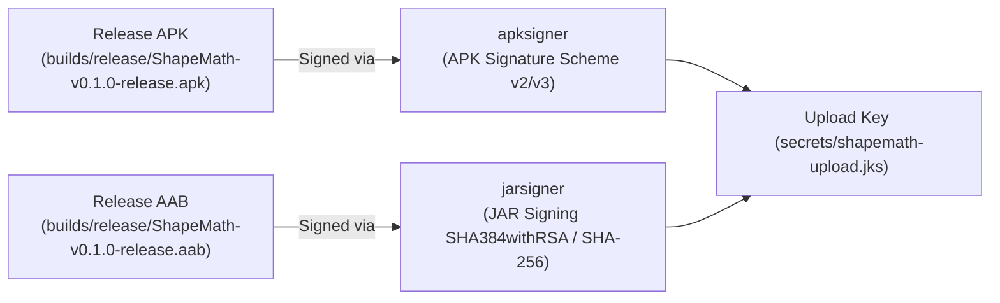

# ShapeMath Android Release Build & Verification Guide

This document defines the repeatable end-to-end workflow to produce, sign, inspect, and verify the production-candidate **Release APK** and **Release AAB** (Android App Bundle) for **ShapeMath** (`com.alcor.shapemath`).

---

## 1. Release Identity & Specification

| Specification | Value | Notes |
| :--- | :--- | :--- |
| **Package Name** | `com.alcor.shapemath` | Immutable Google Play Application ID |
| **Application Label** | `ShapeMath` | Display name on launcher & system UI |
| **Version Name** | `0.1.0` | User-facing semantic version |
| **Version Code** | `1` | Monotonically increasing release integer |
| **Min SDK** | `24` | Android 7.0 Nougat |
| **Target SDK** | `36` | Android 16 (Google Play 2026 requirement) |
| **Native Architecture** | `arm64-v8a` | Optimized 64-bit ARM binary |
| **Requested Permissions** | `android.permission.VIBRATE` | For gameplay tactile haptics |
| **Renderer** | `gl_compatibility` (OpenGL ES 3.0) | High performance & maximum compatibility |
| **Upload Keystore** | `secrets/shapemath-upload.jks` | 4096-bit RSA (alias `shapemath-upload`) |
| **Upload Certificate SHA-256** | `65:48:47:D8:F9:0D:38:19:DB:28:22:9D:D0:7B:A5:E3:3E:EF:A2:40:29:A5:B9:AB:B5:21:90:A2:C9:21:02:71` | Public upload fingerprint |

---

## 2. Tooling Prerequisites

- **Godot Engine:** `Godot_v4.7.2-stable_win64_console.exe`
- **JDK 21:** `jarsigner.exe`, `keytool.exe` (`C:\Program Files\Java\jdk-21.0.12\bin`)
- **Android SDK Build Tools 35 / 36:** `aapt.exe`, `apksigner.bat` (`C:\Android\Sdk\build-tools\35.0.1`)
- **Android Gradle Build Template:** Extracted in `res://android/build` (gitignored).

---

## 3. Artifact Directory Structure

```text
builds/
  debug/
    ShapeMath-debug.apk          <- Internal development builds (signed with Godot debug cert)
  release/
    ShapeMath-v0.1.0-release.apk  <- Production release APK for QA & physical device testing
    ShapeMath-v0.1.0-release.aab  <- Production release AAB for Google Play Console upload
    SHA256SUMS.txt               <- Cryptographic file checksums
```
*(All paths inside `builds/`, `secrets/`, and `android/` remain excluded by `.gitignore`.)*

---

## 4. Signing Tooling Distinction: APK vs AAB



> [!IMPORTANT]
> - **`apksigner`** is used exclusively for `.apk` binaries. It validates APK Signature Scheme v2/v3 and will not process `.aab` bundles.
> - **`jarsigner`** is used exclusively for `.aab` bundles. Google Play requires JAR-signed distribution bundles.
> - Never hardcode or commit keystore passwords in `export_presets.cfg` or scripts. Always provide passwords interactively during signing.

---

## 5. Release APK Workflow (Export, Sign, Verify)

### Step 1: Export Aligned Release APK
```powershell
& "C:\Tools\Godot\Godot_v4.7.2-stable_win64_console.exe" --headless --export-release "ShapeMath Android" "builds/release/ShapeMath-v0.1.0-release.apk"
```

### Step 2: Sign APK with Upload Key
```powershell
& "C:\Android\Sdk\build-tools\35.0.1\apksigner.bat" sign `
  --ks "secrets/shapemath-upload.jks" `
  --ks-key-alias "shapemath-upload" `
  "builds/release/ShapeMath-v0.1.0-release.apk"
```
*(Enter the upload keystore passphrase interactively when prompted.)*

### Step 3: Verify APK Cryptographic Signature
```powershell
& "C:\Android\Sdk\build-tools\35.0.1\apksigner.bat" verify --verbose --print-certs "builds/release/ShapeMath-v0.1.0-release.apk"
```
Expected checks:
- `Verifies: true`
- `Verified using v2 scheme: true`
- `Verified using v3 scheme: true`
- `Signer #1 certificate DN: CN=ShapeMath Upload Key, OU=ShapeMath, O=Alcor, C=TR`
- `Signer #1 certificate SHA-256: 654847d8f90d3819db28229dd07ba5e33eefa24029a5b9abb52190a2c9210271`

### Step 4: Inspect APK Package Badging & Permissions
```powershell
& "C:\Android\Sdk\build-tools\35.0.1\aapt.exe" dump badging "builds/release/ShapeMath-v0.1.0-release.apk"
```
Expected checks:
- `package: name='com.alcor.shapemath' versionCode='1' versionName='0.1.0'`
- `targetSdkVersion:'36'`, `sdkVersion:'24'`
- `native-code: 'arm64-v8a'`
- `uses-permission: name='android.permission.VIBRATE'`
- Non-debuggable build (`application-debuggable` is absent).

---

## 6. Release AAB Workflow (Export, Sign, Verify)

### Step 1: Export Project Pack Asset
```powershell
& "C:\Tools\Godot\Godot_v4.7.2-stable_win64_console.exe" --headless --export-pack "ShapeMath Android" "android/build/src/main/assets/ShapeMath.pck"
```

### Step 2: Compile Release Bundle via Gradle
```powershell
& ".\android\build\gradlew.bat" -p "android/build" bundleStandardRelease `
  -Pexport_package_name="com.alcor.shapemath" `
  -Pexport_version_name="0.1.0" `
  -Pexport_version_code="1" `
  -Pexport_version_min_sdk="24" `
  -Pexport_version_target_sdk="36" `
  -Pexport_format="aab" `
  -Pperform_signing="false"

Copy-Item -Path "android/build/build/outputs/bundle/standardRelease/build-standard-release.aab" -Destination "builds/release/ShapeMath-v0.1.0-release.aab" -Force
```

### Step 3: Sign AAB with `jarsigner`
```powershell
& "C:\Program Files\Java\jdk-21.0.12\bin\jarsigner.exe" -verbose `
  -sigalg SHA384withRSA `
  -digestalg SHA-256 `
  -keystore "secrets/shapemath-upload.jks" `
  "builds/release/ShapeMath-v0.1.0-release.aab" `
  "shapemath-upload"
```
*(Enter the upload keystore passphrase interactively when prompted.)*

### Step 4: Verify AAB Signature & Certificate
```powershell
& "C:\Program Files\Java\jdk-21.0.12\bin\jarsigner.exe" -verify -verbose -certs "builds/release/ShapeMath-v0.1.0-release.aab"
```
Expected output: `jar verified.` with signer `CN=ShapeMath Upload Key, OU=ShapeMath, O=Alcor, C=TR`.

### Step 5: Verify Certificate Fingerprint in AAB
```powershell
& "C:\Program Files\Java\jdk-21.0.12\bin\keytool.exe" -printcert -jarfile "builds/release/ShapeMath-v0.1.0-release.aab"
```
Expected SHA-256: `65:48:47:D8:F9:0D:38:19:DB:28:22:9D:D0:7B:A5:E3:3E:EF:A2:40:29:A5:B9:AB:B5:21:90:A2:C9:21:02:71`.

---

## 7. Cryptographic Checksums

Generate local SHA-256 hashes to ensure artifact integrity:
```powershell
$apkHash = (Get-FileHash -Algorithm SHA256 "builds/release/ShapeMath-v0.1.0-release.apk").Hash.ToLower()
$aabHash = (Get-FileHash -Algorithm SHA256 "builds/release/ShapeMath-v0.1.0-release.aab").Hash.ToLower()
$content = "$apkHash  ShapeMath-v0.1.0-release.apk`n$aabHash  ShapeMath-v0.1.0-release.aab`n"
Set-Content -Path "builds/release/SHA256SUMS.txt" -Value $content
```

---

## 8. Physical Android Smoke Test Checklist

> [!NOTE]
> `.aab` bundles cannot be directly installed on Android devices. Physical device smoke testing must be conducted using the **signed release APK** (`builds/release/ShapeMath-v0.1.0-release.apk`).

- [ ] Sideload/Install: `adb install -r builds/release/ShapeMath-v0.1.0-release.apk`
- [ ] Cold launch & boot splash display
- [ ] Main menu rendering & interactive "Oyuna Başla" button
- [ ] Level load (Tier 1 Math Match / Shape Match)
- [ ] Drag-and-drop gameplay (correct piece snap, invalid drop rejection, neutral cancel)
- [ ] Settings menu overlay (Sound and Haptics toggles respond)
- [ ] In-game Android Back navigation (Game -> Pause Menu -> Main Menu)
- [ ] Life loss & streak progression
- [ ] Clean exit without memory leak or ANR crash

---

## 9. Google Play Internal Testing & Deferred Validation

- **Google Play Console Ingestion:** The signed `ShapeMath-v0.1.0-release.aab` is ready for upload to the **Internal Testing Track**.
- **Play App Signing:** Google Play will ingest the bundle, verify the upload key against the registered certificate, and sign device-optimized split APKs using Google's Master App Signing Key.
- **Bundletool (Optional):** Local extraction of `.apks` via `bundletool` is deferred and optional, as Google Play Console provides automated pre-launch reports and dynamic delivery validation upon upload.
