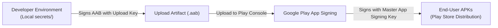

# ShapeMath Android Release Signing & Security Guide

This document defines the release signing architecture, upload key management, and security procedures for the **ShapeMath** Android application (`com.alcor.shapemath`).

---

## 1. Overview & Google Play App Signing

ShapeMath uses the modern **Google Play App Signing** model:



- **Upload Key (`secrets/shapemath-upload.jks`):** Used exclusively by the developer/CI to sign `.aab` artifacts for upload to the Google Play Console.
- **App Signing Key (Google Managed):** Managed securely by Google to sign the final optimized APKs distributed to user devices.
- **Key Recovery:** If the local upload key is lost or compromised, the developer can request an Upload Key Reset directly through the Google Play Console identity verification process without stranding existing installed users.

---

## 2. Keystore Specifications

| Field | Value |
| :--- | :--- |
| **Local Path** | `secrets/shapemath-upload.jks` (Strictly gitignored) |
| **Keystore Format** | PKCS12 / JKS compatible |
| **Key Alias** | `shapemath-upload` |
| **Key Algorithm** | `RSA` |
| **Key Size** | `4096 bits` |
| **Validity** | `10000 days` (~27 years) |
| **Distinguished Name (DName)** | `CN=ShapeMath Upload Key, OU=ShapeMath, O=Alcor, C=TR` |

---

## 3. Keystore Generation Procedure

To generate the upload keystore locally using JDK 21:

```powershell
& "C:\Program Files\Java\jdk-21.0.12\bin\keytool.exe" -genkeypair `
  -v `
  -keystore "secrets/shapemath-upload.jks" `
  -alias "shapemath-upload" `
  -keyalg "RSA" `
  -keysize 4096 `
  -validity 10000 `
  -dname "CN=ShapeMath Upload Key, OU=ShapeMath, O=Alcor, C=TR"
```
*(Keytool will interactively prompt for a strong password. Do not hardcode or commit this password.)*

---

## 4. Keystore Backup & Security Policy

> [!CAUTION]
> Signing credentials, private keys, and passwords must **NEVER** be committed to Git, shared in chat logs, or stored in plaintext in repository files.

1. **Primary Working Location:** `secrets/shapemath-upload.jks` (excluded by `.gitignore`).
2. **Encrypted Vault Backup:**
   - Store an encrypted copy of `shapemath-upload.jks` in a secure offline vault or password manager.
   - Record the key alias (`shapemath-upload`) and the keystore password separately in the vault.
3. **Repository Cleanliness:**
   - `.gitignore` must continuously exclude `*.keystore`, `*.jks`, `/secrets/`, `*.env`, and `/builds/`.
   - `export_presets.cfg` must never contain plaintext release passwords in version control.

---

## 5. Verification Tools

To inspect the certificate fingerprint without exposing private keys:

```powershell
& "C:\Program Files\Java\jdk-21.0.12\bin\keytool.exe" -list -v -keystore "secrets/shapemath-upload.jks" -alias "shapemath-upload"
```

To verify the signature of a signed release APK:

```powershell
& "C:\Android\Sdk\build-tools\35.0.1\apksigner.bat" verify --verbose "builds/release/ShapeMath-v0.1.0-release.apk"
```
